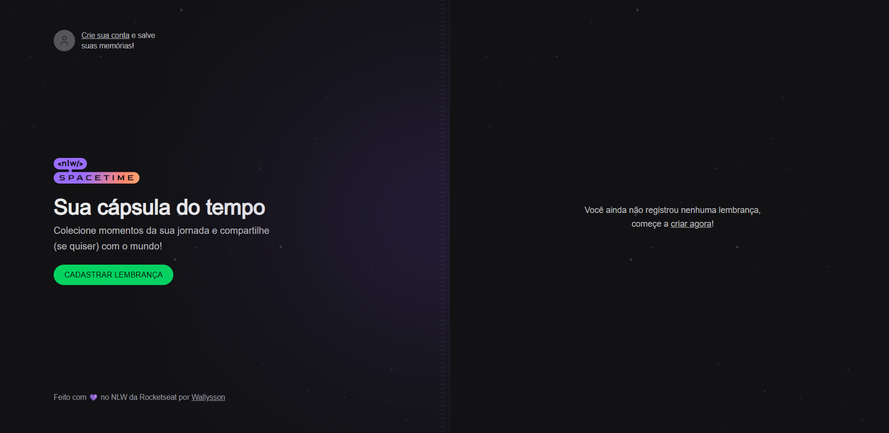
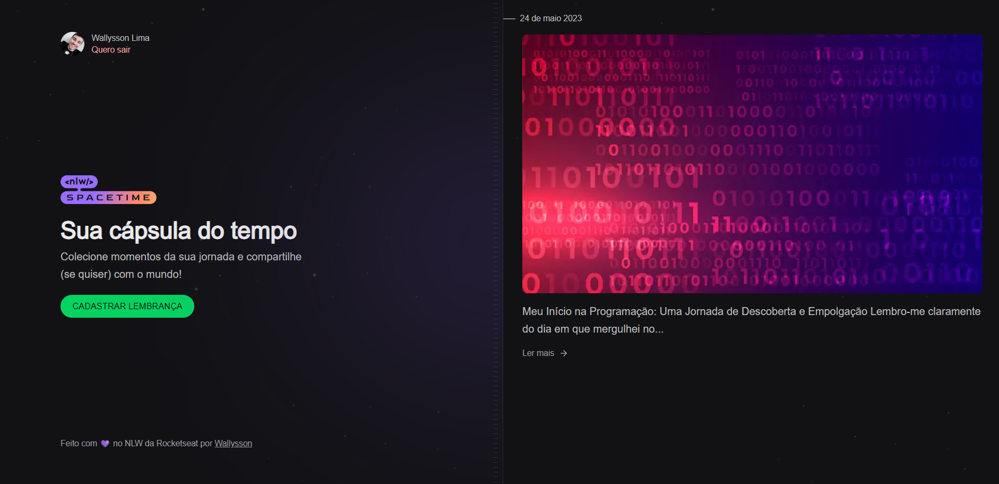

  
  
  
  
  
  
  

# 💻 NLW - Spacetime

Uma aplicação incrível de recordação de memórias desenvolvida durante a NLW (Next Level Week) da Rocketseat. Com esta plataforma envolvente, os usuários podem facilmente adicionar textos, fotos e vídeos de momentos marcantes de suas vidas em uma linha do tempo organizada por mês e ano. Reviva suas lembranças mais queridas enquanto navega pela linha do tempo, relembrando cada detalhe e sentimento especial. Aproveite a experiência única proporcionada pela NLW para criar uma aplicação que captura a magia das suas memórias mais preciosas.

## 🚀 Tecnologias

- [Next.js](https://nextjs.org/)
- [React](https://react.dev/)
- [TypeScript](https://www.typescriptlang.org/)
- [TailwindCSS](https://tailwindcss.com/)
- [LucideReact](https://lucide.dev/)
- [Prisma](https://www.prisma.io/)
- [Axios](https://axios-http.com/)
- [Fastify](https://www.fastify.io/)
- [Zod](https://github.com/colinhacks/zod)

## 📑 Features

- Linha do Tempo Organizada: Crie uma linha do tempo organizada por mês e ano para adicionar textos, fotos e vídeos de momentos marcantes da vida;
- Autenticação via GitHub: Permita aos usuários fazer login na aplicação utilizando o GitHub, utilizando um estilo de autenticação JWT (JSON Web Tokens). Isso proporcionará uma experiência de login simples e segura para os usuários;
- Adição de Textos, Fotos e Vídeos: Os usuários poderão adicionar textos descritivos, fotos e vídeos aos momentos da linha do tempo. Isso permitirá que eles registrem e revivam as memórias mais preciosas.

## 💡 Desafios
- Responsividade: Garanta que o projeto seja responsivo, ou seja, capaz de se adaptar e oferecer uma experiência de usuário otimizada em diferentes dispositivos, como smartphones, tablets e computadores. Isso envolve a criação de layouts flexíveis, imagens e conteúdo ajustáveis, e uma navegação intuitiva em todas as telas; ✔️
- Edição e Exclusão de Conteúdo: Desenvolva uma funcionalidade que permita aos usuários editar e excluir facilmente os textos, fotos e vídeos que foram adicionados à linha do tempo. Isso dará aos usuários maior controle sobre suas memórias, permitindo que eles façam ajustes, correções ou remoções conforme necessário; ⌛
- Visualização Detalhada das Memórias: Implemente uma forma de os usuários visualizarem os detalhes completos de cada memória ao navegar pela linha do tempo. Isso inclui a exibição da data em que a memória foi registrada, uma descrição detalhada do evento e a visualização da mídia associada, como fotos e vídeos. Isso proporcionará uma experiência mais imersiva e enriquecedora ao reviver momentos especiais; ✔️
- Compartilhamento de Memórias: Integre recursos de compartilhamento que permitam aos usuários compartilhar suas memórias favoritas com amigos e familiares. Isso pode ser feito através de opções de compartilhamento em redes sociais, geração de links diretos para memórias específicas ou até mesmo o envio de convites para que outras pessoas possam acessar e desfrutar das memórias compartilhadas. ⌛

## 🖼️ Previews

| Home Spacetime                            | Preview Spacetime                             |
| ----------------------------------------- | ------------------------------------------ |
|  |  |